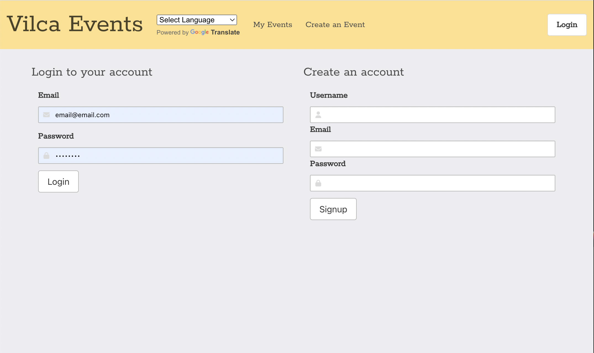
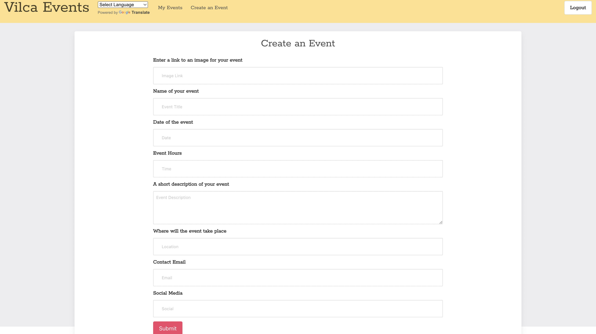
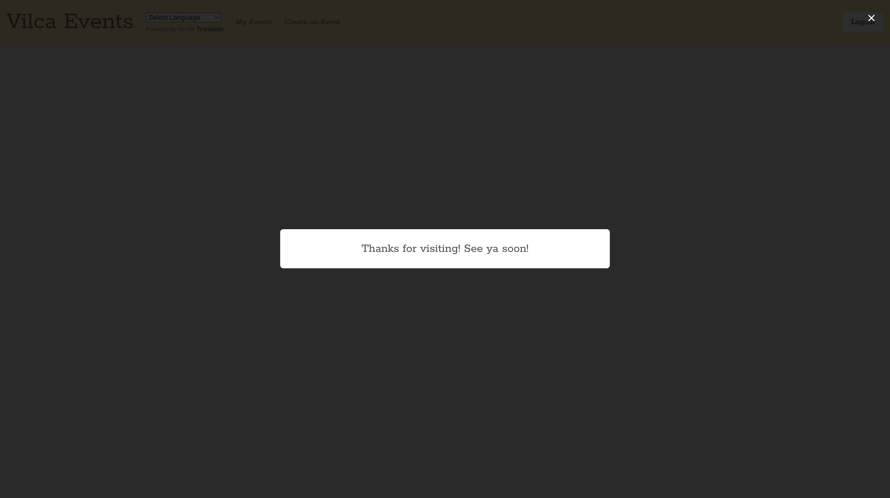

# Vilca--Events

## Table of Contents 

- [Description](#description)
- [Usage](#usage)
- [Contributors](#contributors)
- [License](#license)
- [Questions](#questions)

## Description
Vilca Events application was created in order to implement an easy alternative to posting paper flyers around town. Users will be able to find the latest and greatest events around town all in one spot! This application was built using Node.js and Express to create a RESTful API. Handlebars is used as the templating engine and MySQL and Sequelize ORM are used for the database. This application is deployed using Heroku.

## Usage

## Contributors
+ Brenn Voyles
+ Margaret Saylor
+ Jeevan Morgan Kreb-Jones
+ Priyanka Agrawal

## License
[MIT License](https://spdx.org/licenses/MIT.html)

Permission is hereby granted, free of charge, to any person obtaining a copy
of this software and associated documentation files (the "Software"), to deal
in the Software without restriction, including without limitation the rights
to use, copy, modify, merge, publish, distribute, sublicense, and/or sell
copies of the Software, and to permit persons to whom the Software is
furnished to do so.

## Questions 
If there are any additional questions, feel free to reach out by email or github.

Email: 
+ [brennaveir@hotmail.com](mailto:brennaveir@hotmail.com)
+ [saylor.margaret@gmail.com](mailto:saylor.margaret@gmail.com)
+ [jeevanjones.jmkj@gmail.com](mailto:jeevanjones.jmkj@gmail.com)
+ [pri.ag25@gmail.com](mailto:pri.ag25@gmail.com)

Github: 
- Brenn Voyles [brennaveir](https://github.com/brennaveir)
- Jeevan Morgan Kreb-Jones [JeevanMKJ](https://github.com/JeevanMKJ)
- Priyanka Agrawal [priyanka-agrawal025](https://github.com/priyanka-agrawal025)
- Margaret Saylor [msaylorphila](https://github.com/msaylorphila)

